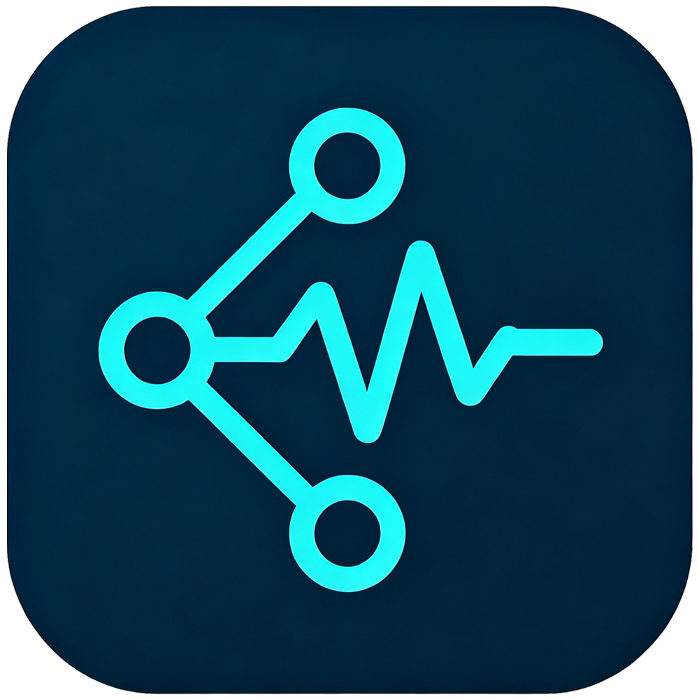
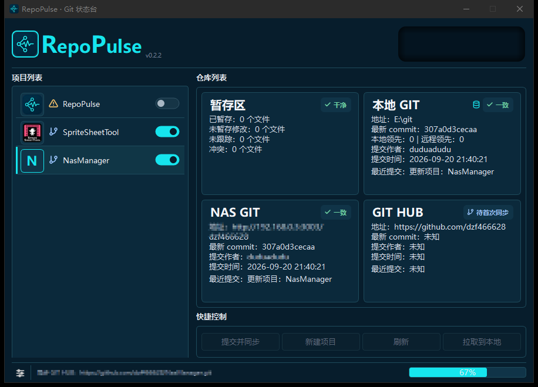
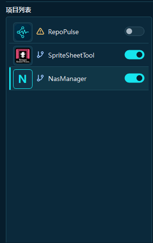
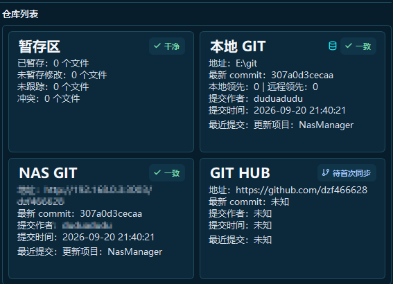

<div align="center">



# RepoPulse · Git 状态台

**把多处仓库的状态，放进同一张桌面**

[](https://github.com/dzf466628/RepoPulse/releases)
[](LICENSE)
[](https://www.python.org/)
[]()
[](https://duadu.cc)

<sub>一个编程小白用AI捣鼓出来的工具，代码可能稀烂但真心好用 · 觉得有用点个 ⭐ Star</sub>

</div>

RepoPulse 是一个面向 Windows 的中文 Git 状态台。把本地、NAS、GitHub 的项目连接起来，一眼看清提交、版本和未同步修改。

项目太多，不知道哪份是最新的 → 远端太散，每次都要手动确认 → 打开 RepoPulse，**一眼看到该做什么**。



---

## 核心能力

### 项目总览 — 先看全局再点细节

左侧项目列表记录你的工作区，右侧用状态卡并列展示本地和远端结果。

- 多个项目集中查看，支持拖动排序
- 状态卡显示 branch、commit、修改数
- 点击仓库即可打开目标位置或终端



### 渠道状态 — 本地、NAS、GitHub，同一条时间线

每个渠道都可以独立检查，仓库是否连通、远端最新提交是什么、三处是否已经对齐。

- 支持 GitHub 与 NAS / Gitea 服务
- SSH、HTTPS 与令牌认证分开处理
- GitHub 失败可以按策略忽略，不阻塞其他渠道



### 同步动作 — 把同步变成一个可确认的流程

需要提交时，明确展示即将处理的项目和渠道。全量同步、修改同步和拉取到本地，都在同一个动作区。

- 提交并同步：本地提交后逐个推送
- 拉取到本地：先确认远端结果再更新
- 后台完成后通过托盘通知结果


### 托盘悬浮 — 放到托盘里，让状态自己更新

收进系统托盘，后台定时刷新或按修改触发同步。悬浮窗拖出主窗口后保持置顶，随时告诉你当前项目和同步结果。

- 实时显示当前项目与各渠道状态
- 拖出后独立置顶，拖回槽位跟随主窗口收起
- 不用打开主窗口也能一键同步


---

## 四步工作流

| 步骤 | 动作 | 说明 |
|------|------|------|
| **1** | 添加项目 | 选择本地工作区，自动读取 Git 信息并建立项目卡片 |
| **2** | 接入渠道 | 按需连接本地 Git、NAS / Gitea 和 GitHub，统一保存连接配置 |
| **3** | 刷新状态 | 查看 branch、commit、未提交修改和多端一致性，后台线程执行 |
| **4** | 同步与继续 | 提交并同步、拉取到本地，或交给定时任务和托盘持续运行 |

---

## 快速开始

### 从源码运行

```powershell
python -m pip install -r requirements.txt
python main.py
```

GitHub 私有仓库请先确认本机 SSH 或 Git Credential Manager 已配置好，并按需打开代理。

### 下载安装包

前往 [软件官网](https://duadu.cc/app/RepoPulse/index.html) 获取最新 Windows 安装包。

安装包面向 Windows 10 / 11 64 位，使用目录版打包。

---

## 常见问题

<details>
<summary><b>RepoPulse 会替代命令行 Git 吗？</b></summary>

不会。它只负责状态查看和快捷入口，底层仍然调用 Git；rebase、cherry-pick、冲突编辑等高级操作继续交给你熟悉的工具。

</details>

<details>
<summary><b>可以同时管理 GitHub 和 NAS 吗？</b></summary>

可以。一个项目可以配置本地、NAS / Gitea、GitHub 多个渠道，刷新时分别检查，结果显示在同一组仓库卡中。

</details>

<details>
<summary><b>网络失败会不会卡住界面？</b></summary>

不会。网络检查和同步由后台线程执行，主窗口不会因为远端响应慢而失去响应；GitHub 还可以按策略忽略失败。

</details>

<details>
<summary><b>设置和项目数据保存在哪里？</b></summary>

默认保存到 Windows 的 `AppData\Roaming\GitStatusDesk\projects.json`。凭据跟随当前配置使用，请按本机安全策略管理访问权限。

</details>

---

## 设计边界

本工具优先做"状态查看和快捷入口"，不重复实现完整的冲突编辑器、rebase、cherry-pick 等高级 Git 功能。

打包相关的历史问题记录见 [docs/packaging-notes.md](docs/packaging-notes.md)。

---

<div align="center">


**[duadu.cc](https://duadu.cc)** · 软件官网：[RepoPulse](https://duadu.cc/app/RepoPulse/index.html) · [GitHub](https://github.com/dzf466628/RepoPulse)

如果这个工具对你有帮助，点个 ⭐ **Star** 支持一下吧！
邮箱 3140992714@qq.com · 微信 vime1230 · 欢迎聊天交流


本软件以 **GNU GPL v3** 开源，可自由使用、修改与再分发。改了啥好玩的欢迎告诉我一声。

</div>

---

## 遥测说明

> 做遥测就俩原因：看看有没有人用，顺便看看哪个功能该砍。有人用我就挺开心的。有bug或者想聊天，邮箱甩过来。

本软件包含匿名使用统计上报，用于了解功能使用情况以改进产品。

**上报内容（均已脱敏）：**
- 软件版本号
- 功能使用计数（仅功能名 + 次数，不含文件名、路径、素材内容）
- 脱敏机器标识（MAC + 硬盘序列号经 SHA256 哈希取前 16 位，不可逆）
- 本机 IP 前三段（如 `192.168.0.*`）

**不上报：** 任何用户文件、路径、素材内容、个人身份信息。


**关闭方式：** 设置环境变量 `HTSJ_DISABLE=1` 即可完全关闭遥测。
